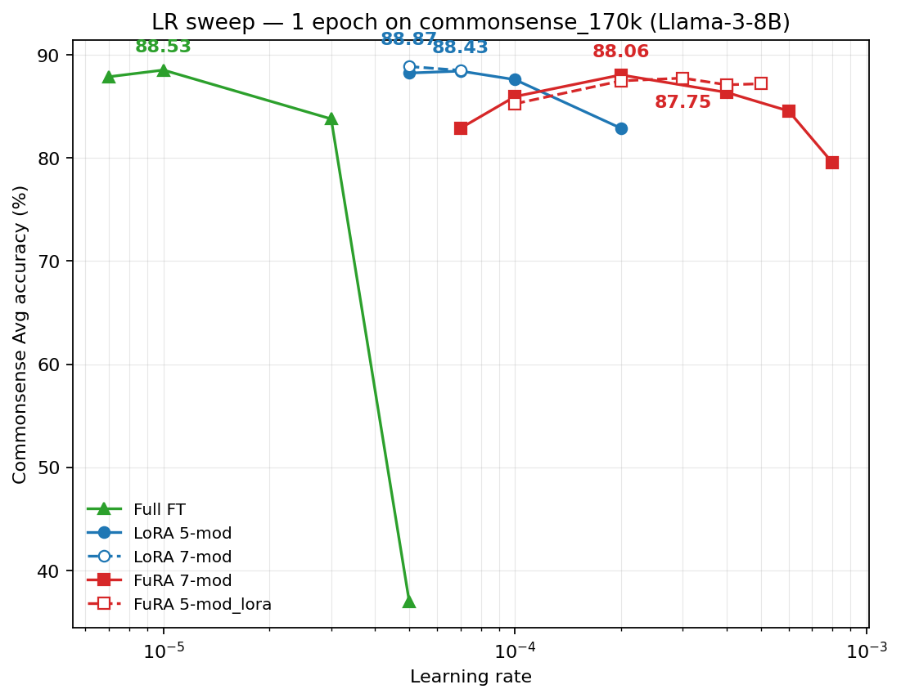

# LIFT Commonsense Results

## Our Runs (`/data/yequan/fura/lift`)

- Source root:`/data/yequan/fura/lift/commonsense/meta-llama/Meta-Llama-3-8B`
- Metric: task accuracy (`Result` from each `eval.log`), averaged across 8 tasks.
- Bold indicates the best value among our runs for that column.

| Run                                              |           BoolQ |            PIQA |            SIQA |       HellaSwag |            Wino |           ARC-e |           ARC-c |            OBQA |             Avg |
| ------------------------------------------------ | --------------: | --------------: | --------------: | --------------: | --------------: | --------------: | --------------: | --------------: | --------------: |
| `output_one_block + smerge_keep_trainable`     | **76.60** |           89.90 | **83.20** | **96.80** | **89.70** | **93.60** | **84.10** | **89.40** | **87.91** |
| `output_one_block + rank_full + smerge_frozen` |           74.00 | **90.80** |           81.90 |           95.90 |           89.40 |           93.40 |           84.00 |           87.60 |           87.12 |
| `input_one_block + rank_full + smerge_frozen`  |           66.30 |           85.60 |           79.50 |           94.70 |           86.10 |           90.50 |           80.50 |           86.80 |           83.75 |
| `input_one_block + smerge_trainable`           |           67.00 |           85.60 |           80.60 |           93.50 |           86.30 |           90.20 |           78.40 |           84.80 |           83.30 |

Runs with missing or incomplete commonsense eval outputs (not included above):

- `blocktt-lr_2e-4-decomp_output_one_block_pos_small_smerge_trainable-seed_43` (no task eval logs)
- `full-lr_5e-5-seed_43` (no task eval logs found)
- `lora-lr_2e-4-rank_128-seed_43` (task eval logs missing/incomplete)
- `meta-llama/Meta-Llama-3-8B/lora/commonsense/lr_2e-4/rank_128_alpha_256/seed_43` (partial task logs only)

## Paper Table

Commonsense reasoning, fine-tuning on Commonsense-170K (from `docs/25_ICML_Principal Weights Emerge after Rank Reduction for Reasoning-Focused Supervised Fine-Tuning.pdf`).

Single unified table: upper half is LLaMA-2-7B (5 methods), lower half is LLaMA-3-8B (7 methods). "Trainable %" is trainable parameters as a fraction of total parameters in the model — directly read from training logs for our runs (fura/MiLoRA/RandLoRA), and computed from the LIFT codebase's 5-module default LoRA recipe (`q_proj k_proj v_proj up_proj down_proj`) for the LIFT-paper baselines (Full FT/LoRA/DoRA/PiSSA). FuRA on LLaMA-3-8B is the mean across 3 seeds (42, 43, 44); see "FuRA Seed Sweep" below for the per-seed numbers. All other rows are single-seed (seed=43). Bold marks the column-best within each model section.

| Method               | Trainable % |           BoolQ |            PIQA |            SIQA |       HellaSwag |            Wino |           ARC-e |           ARC-c |            OBQA |             Avg |
| -------------------- | ----------: | --------------: | --------------: | --------------: | --------------: | --------------: | --------------: | --------------: | --------------: | --------------: |
| **LLaMA-2-7B** |             |                 |                 |                 |                 |                 |                 |                 |                 |                 |
| Full FT              |      100.00 |           73.80 |           84.20 |           81.00 |           94.70 |           85.20 |           88.90 | **75.60** |           84.80 |           83.53 |
| LoRA                 |        3.33 |           70.80 |           82.80 |           79.40 |           92.90 |           83.40 |           86.30 |           71.60 |           82.80 |           81.25 |
| DoRA                 |        3.34 |           71.30 |           83.40 |           80.10 |           92.30 |           84.00 |           86.10 |           71.40 | **85.80** |           81.80 |
| PiSSA                |        3.33 |           72.50 |           85.30 |           80.80 |           87.20 |           86.10 |           87.10 |           74.30 |           85.60 |           82.36 |
| FuRA                 |        1.53 | **74.60** | **86.70** | **82.50** | **95.20** | **86.30** | **89.00** | **75.60** |           85.40 | **84.41** |
| **LLaMA-3-8B** |             |                 |                 |                 |                 |                 |                 |                 |                 |                 |
| Full FT              |      100.00 |           75.40 |           88.00 |           81.80 |           96.50 |           89.30 |           93.10 |           83.00 |           86.00 |           86.64 |
| LoRA                 |        1.39 |           71.80 |           85.30 |           80.90 |           93.40 |           84.50 |           90.00 |           77.00 |           84.80 |           83.46 |
| DoRA                 |        1.42 |           74.60 |           87.40 |           81.20 |           94.70 |           87.10 |           89.40 |           79.50 |           86.40 |           85.04 |
| PiSSA                |        1.39 |           74.90 |           87.70 |           82.30 |           95.30 |           87.70 |           92.90 |           81.40 |           87.00 |           85.90 |
| MiLoRA               |        1.39 |           73.70 |           87.30 |           80.70 |           94.30 |           87.20 |           91.20 |           78.90 |           86.40 |           84.96 |
| RandLoRA             |        0.33 |           73.10 |           85.50 |           79.40 |           93.10 |           85.90 |           87.90 |           75.90 |           85.40 |           83.28 |
| FuRA (3-seed mean)   |        1.46 | **76.47** | **90.43** | **83.00** | **96.83** | **89.87** | **93.67** | **84.50** | **89.33** | **88.01** |

### Best Of Our Runs (LLaMA-3-8B)

| Run                                          |           BoolQ |  PIQA |            SIQA |       HellaSwag |            Wino |           ARC-e |           ARC-c |            OBQA |             Avg |
| :------------------------------------------- | --------------: | ----: | --------------: | --------------: | --------------: | --------------: | --------------: | --------------: | --------------: |
| `output_one_block + smerge_keep_trainable` | **76.60** | 89.90 | **83.20** | **96.80** | **89.70** | **93.60** | **84.10** | **89.40** | **87.91** |

### BlockTT Ablation (LLaMA-3-8B, no calibration)

Decompose each linear as `W = L · S · R` with L on the output side and R on the input side. **Bold** = trainable; `(SR)` / `(LS)` parentheses mean S is merged into the adjacent core and the merged tensor is trained as one parameter; no parentheses on `S` = `btt_s` is held as a separate parameter (its trainability follows the bolding). Restricted to runs without calibration (`calib_none` plus runs with no `calib_*` prefix; `calib_v2*` runs excluded). FuRA (PEFT) rows use `pos_small` and `lr 2e-4`; FuRA (full) trains both cores plus S (`pos_both`, lr 1e-5); Full FT is the standard fine-tuning baseline.

| Notation                     | Trainable % |           BoolQ |            PIQA |            SIQA |       HellaSwag |            Wino |           ARC-e |           ARC-c |            OBQA |             Avg |
| :--------------------------- | ----------: | --------------: | --------------: | --------------: | --------------: | --------------: | --------------: | --------------: | --------------: | --------------: |
| Full FT                      |      100.00 |           75.40 |           88.00 |           81.80 |           96.50 |           89.30 |           93.10 |           83.00 |           86.00 |           86.64 |
| FuRA (full):**L S R**  |       87.10 |           76.10 | **90.80** |           82.90 | **96.80** |           89.30 | **94.40** | **85.20** |           88.80 | **88.04** |
| FuRA (PEFT): L**SR**   |        1.46 | **76.60** |           89.90 | **83.20** | **96.80** | **89.70** |           93.60 |           84.10 | **89.40** |           87.91 |
| FuRA (PEFT): (LS)**R** |        1.39 |           74.00 | **90.80** |           81.90 |           95.90 |           89.40 |           93.40 |           84.00 |           87.60 |           87.12 |
| FuRA (PEFT): L**(SR)**       |        1.39 |           74.80 |           76.60 |           82.20 |           95.40 |           86.40 |           90.90 |           81.60 |           84.80 |           84.09 |
| FuRA (PEFT):**LS**R    |        1.46 |           75.00 |           89.50 |           81.90 |           96.20 |           88.10 |           93.20 |           83.00 |           87.40 |           86.79 |
| FuRA (PEFT):**L**(SR)  |        1.39 |           66.30 |           85.60 |           79.50 |           94.70 |           86.10 |           90.50 |           80.50 |           86.80 |           83.75 |
| FuRA (PEFT): **(LS)**R       |        1.39 |           67.00 |           85.60 |           80.60 |           93.50 |           86.30 |           90.20 |           78.40 |           84.80 |           83.30 |

FuRA (full) is `blocktt-calib_none-lr_1e-5-decomp_output_one_block_pos_both_smerge_keep_trainable-seed_43` (~7.10B trainable params). FuRA (PEFT) L**SR** is the headline run `blocktt-lr_2e-4-decomp_output_one_block_pos_small_smerge_keep_trainable-seed_43` (~118.7M trainable params, R + S). The other PEFT rows differ only in s-placement: rows with no parens on S keep `btt_s` as a separate trainable param (+0.07% trainable); rows that merge S into a core have S absorbed (no extra param). FuRA (full) edges PEFT L**SR** by +0.13 Avg (88.04 vs 87.91) and beats Full FT by +1.40, while the 60× difference in trainable params between FuRA (full) and PEFT buys almost nothing on Avg — the gain comes from the spectral re-parameterization, not the extra parameters.

#### Shape factorization ablation (1 epoch, lr=2e-4, seed 43)

Holding the s-placement recipe fixed at the headline L**SR** (`output_one_block + keep_trainable`, `pos_small`), this sub-ablation varies how the input dimension `din` is split into `(n, b)` with `n·b = din`. Under `output_one_block` only the input-side factorization survives (`m=1`, `a=dout`); the output side is fixed.

| Shape variant                                       | Trainable % |           BoolQ |            PIQA |            SIQA |       HellaSwag |            Wino |           ARC-e |           ARC-c |            OBQA |             Avg |
| :-------------------------------------------------- | ----------: | --------------: | --------------: | --------------: | --------------: | --------------: | --------------: | --------------: | --------------: | --------------: |
| Default (head-aligned attn / closest mlp; b≈√din) |        1.46 | **75.70** | **90.80** | **83.80** | **96.80** | **88.70** | **93.70** | **84.60** | **90.40** | **88.06** |
| Unbalanced (b=8 across all modules)                 |        0.03 |           68.00 |           86.20 |           74.10 |           91.20 |           75.70 |           90.20 |           77.10 |           77.40 |           79.99 |
| Extreme (b=1, n=din)                                |        0.14 |           35.80 |           47.70 |           32.90 |           24.50 |           47.40 |           25.30 |           24.20 |           27.60 |           33.18 |

Concretely on LLaMA-3-8B: default is `(n=32, b=128)` for q/k/v/o (head-aligned, `n=num_heads`, `b=head_dim`), `(n=64, b=64)` for gate/up, and `(n=112, b=128)` for down (closest factor pair). Unbalanced is `(n=512, b=8)` for q/k/v/o and gate/up, `(n=1792, b=8)` for down. Extreme is `b=1, n=din` for every module.

Reading: a more balanced shape factorization is preferred. Pushing the input dim toward small `b` (large `n`) hurts model quality monotonically — Avg drops from 88.06 (balanced) to 79.99 (b=8) to 33.18 (b=1, chance-level). The trainable-parameter count under `pos_small + keep_trainable` is dominated by `numel(R) = rank · in_features` with `rank = min(a, b)`; shrinking `b` shrinks the rank cap as well as the small-core size, so very small `b` is a double penalty: representational capacity (lower achievable rank) and trainable budget shrink together. Note that Cell 3 (`b=1`, rank=1) ends up with more trainable params than Cell 2 (`b=8`, rank=8) because `btt_s` flips to dominate the small-core count under rank=1, but model quality is still worse — capacity matters more than raw param count once the rank collapses.

How to launch this ablation:

- CLI flag: `--blocktt_input_factorization` on `ref/LIFT/src/finetune_blocktt.py` (and `finetune_qfura.py`). Accepts either a scalar (`"head"`, `"closest"`, or `"n,b"`) or a JSON/Python dict mapping module groups (`qkv`, `o`, `mlp_upgate`, `mlp_down`) or leaf module names (`q_proj`, …, `down_proj`) to individual specs. When set, this overrides `--blocktt_factorize_by_head` for any module covered. The arg validates `n·b == in_features` per module.
- Bash plumbing: `ref/LIFT/bash_scripts/finetune_commonsense_blocktt.sh` reads the `blocktt_input_factorization` env var and forwards it to the Python script.
- Per-cell launcher: `launchers/shape_ablation_llama3_8b.sh` picks one of three preset cells via `CELL={1,2,3}` and also takes `GPU`, `SEED`, `LR`, `EPOCHS` env vars (defaults: `SEED=43`, `LR=2e-4`, `EPOCHS=3`). The three cells are: (1) head-aligned attn + closest mlp (the default; matches the existing FuRA recipe), (2) unbalanced `b=8` across all modules, (3) extreme `b=1, n=din`. Each cell calls into `finetune_commonsense_blocktt.sh`, so training + the full 8-task commonsense eval run automatically when `MAX_STEPS=0` (default). The cell tag and epoch count are embedded in `OUTPUT` / `run_name`.
- Sequential driver: `launchers/gpu6_shape_ablation_seq.sh` runs cells 2 and 3 back-to-back on GPU 6 at 1 epoch; the driver log lands at `/data/yequan/fura/lift/launch_logs/shape_ablation/gpu6_seq_ep1.log`. Adapt by editing the cell list, `GPU`, or `EPOCHS` in the loop.
- Tests: `tests/test_btt_input_factorization_cli.py` covers the parser plus end-to-end `(n, b)` shape verification on a fake LLaMA-3-8B decoder block for each preset spec. Run with `uv run python -m unittest discover -s tests -p test_btt_input_factorization_cli.py`.

Side note on which side is small: for `output_one_block` (m=1, a=out_features, n=in_blocks, b=in_block_size), `btt_l.numel() = rank · n · out_features` and `btt_r.numel() = rank · in_features`, so **R is the small side** (factor of `n` smaller). With `pos_small`, R trains. Symmetrically for `input_one_block` (n=1), L is the small side and L trains.

Takeaways: (i) Holding `S` as a separate trainable scaling (`keep_trainable`) is the strongest s-placement for **both** decomp orientations: 87.91 for `output_one_block` vs 86.79 for `input_one_block`, with the next-best non-keep_trainable variant (output `(LS) **R**`) at 87.12 in between. Merging `S` into one of the cores (parens) costs ~1–4 Avg points relative to keep_trainable. (ii) `output_one_block` still beats `input_one_block` at the same s-placement (87.91 vs 86.79 for keep_trainable; 87.12 vs 83.75 for the merged-into-frozen variant), confirming the small-core-on-input geometry helps. (iii) Seed variance for the headline `output_one_block + keep_trainable` recipe is small across consecutive seeds 42/43/44 (88.13 / 87.91 / 88.00, std=0.09 — see "FuRA Seed Sweep" below), but much larger across non-consecutive seeds 0/43/100 (85.97 / 87.91 / 87.08, std=0.81). The 3-seed mean reported in the paper table uses 42/43/44.

## FuRA Seed Sweep (3 epoch, LLaMA-3-8B)

Three seeds of the FuRA (PEFT) recipe `output_one_block + pos_small + smerge_keep_trainable + lr_2e-4 + 3ep` on `commonsense_170k`. seed=43 is the existing headline run (under the legacy `blocktt-lr_2e-4-...` name); seed=42 and seed=44 use the modern `blocktt-calib_none-lr_2e-4-...` naming. All three share identical training hyperparameters (per-device bsz=8, grad-accum=2, max_seq=2048, linear LR schedule with 3% warmup) and identical eval (eval seed = 1234, full 8-task suite). Std is the population std across 3 seeds.

| Seed           | BoolQ |  PIQA |  SIQA | HellaSwag |  Wino | ARC-e | ARC-c |  OBQA |   Avg |
| :------------- | ----: | ----: | ----: | --------: | ----: | ----: | ----: | ----: | ----: |
| seed=42        | 76.30 | 90.60 | 83.00 |     96.80 | 90.10 | 93.80 | 85.40 | 89.00 | 88.13 |
| seed=43        | 76.60 | 89.90 | 83.20 |     96.80 | 89.70 | 93.60 | 84.10 | 89.40 | 87.91 |
| seed=44        | 76.50 | 90.80 | 82.80 |     96.90 | 89.80 | 93.60 | 84.00 | 89.60 | 88.00 |
| Mean (3 seeds) | 76.47 | 90.43 | 83.00 |     96.83 | 89.87 | 93.67 | 84.50 | 89.33 | 88.01 |
| Std            |  0.12 |  0.39 |  0.16 |      0.05 |  0.17 |  0.09 |  0.64 |  0.25 |  0.09 |

Run dirs:

- seed=42 → `/data/yequan/fura/lift/commonsense/meta-llama/Meta-Llama-3-8B/blocktt-calib_none-lr_2e-4-decomp_output_one_block_pos_small_smerge_keep_trainable-seed_42/last/`
- seed=43 → `/data/yequan/fura/lift/commonsense/meta-llama/Meta-Llama-3-8B/blocktt-lr_2e-4-decomp_output_one_block_pos_small_smerge_keep_trainable-seed_43/`
- seed=44 → `/data/yequan/fura/lift/commonsense/meta-llama/Meta-Llama-3-8B/blocktt-calib_none-lr_2e-4-decomp_output_one_block_pos_small_smerge_keep_trainable-seed_44/last/`

Launch logs (seeds 42 / 44):

- `/data/yequan/fura/lift/launch_logs/gpu4_fura_3ep_seed42.log`
- `/data/yequan/fura/lift/launch_logs/gpu5_fura_3ep_seed44.log`

Takeaways: across-seed Avg std is **0.09** (range 87.91–88.13, span 0.22). Per-task std is largest on ARC-c (0.64) and PIQA (0.39), tightest on HellaSwag (0.05) and ARC-e (0.09). The seed=43 single-seed number used in the paper table (87.91) sits at the **lower end** of the seed distribution; the 3-seed mean (88.01) is +0.10 higher and is what now appears in the paper table.

## Full Eval Sweep (LLaMA-3-8B, `/data/yequan/fura/lift/commonsense/meta-llama/Meta-Llama-3-8B`)

All runs with complete 8-task eval logs. Eval logs were collected from `commonsense/`, `last/commonsense/`, and `best/commonsense/` subdirectories. Bold marks the column-best across this table.

| Method   | Run config                                                                                                |           BoolQ |            PIQA |            SIQA |       HellaSwag |            Wino |           ARC-e |           ARC-c |            OBQA |             Avg |
| -------- | --------------------------------------------------------------------------------------------------------- | --------------: | --------------: | --------------: | --------------: | --------------: | --------------: | --------------: | --------------: | --------------: |
| full     | `lr_1e-5 (seed 43, last)`                                                                               | **76.60** | **90.80** |           82.40 | **97.00** | **89.90** |           93.80 |           85.00 | **90.20** | **88.21** |
| blocktt  | `calib_none + lr_1e-5 + output_one_block + pos_both + smerge_keep_trainable (seed 43, last; FuRA full)` |           76.10 | **90.80** |           82.90 |           96.80 |           89.30 | **94.40** | **85.20** |           88.80 |           88.04 |
| blocktt  | `lr_2e-4 + output_one_block + pos_small + smerge_keep_trainable (seed 43)`                              | **76.60** |           89.90 | **83.20** |           96.80 |           89.70 |           93.60 |           84.10 |           89.40 |           87.91 |
| qfura    | `lr_2e-4 + layout_flat + output_one_block + smerge_keep_trainable (seed 43)`                            |           73.00 |           89.90 |           82.70 |           96.60 |           89.10 |           93.10 |           83.40 |           90.60 |           87.30 |
| blocktt  | `lr_2e-4 + output_one_block + pos_small + rank_full + smerge_frozen (seed 43)`                          |           74.00 | **90.80** |           81.90 |           95.90 |           89.40 |           93.40 |           84.00 |           87.60 |           87.12 |
| blocktt  | `calib_none + lr_1e-4 + output_one_block + pos_small + smerge_keep_trainable (seed 43, last)`           |           74.80 |           89.60 |           82.30 |           96.20 |           87.30 |           93.90 |           83.40 |           89.20 |           87.09 |
| blocktt  | `calib_none + lr_2e-4 + output_one_block + pos_small + smerge_keep_trainable (seed 0)`                  |           69.60 |           89.70 |           82.30 |           96.30 |           89.00 |           94.00 |           84.90 | **90.80** |           87.08 |
| pissa    | `lr_2e-5 + rank_64 (seed 43, last)`                                                                     |           74.90 |           88.70 |           82.30 |           96.30 |           89.70 |           92.90 |           81.40 |           89.00 |           86.90 |
| blocktt  | `calib_none + lr_2e-4 + input_one_block + pos_small + smerge_keep_trainable (seed 43, last)`            |           75.00 |           89.50 |           81.90 |           96.20 |           88.10 |           93.20 |           83.00 |           87.40 |           86.79 |
| blocktt  | `calib_none + lr_2e-4 + output_one_block + pos_small + smerge_keep_trainable (seed 100)`                |           64.00 |           89.00 |           82.70 |           95.90 |           89.60 |           93.80 |           82.80 |           90.00 |           85.97 |
| milora   | `lr_1e-4 + rank_64 (seed 43, last)`                                                                     |           73.70 |           87.30 |           80.70 |           94.30 |           87.20 |           91.20 |           78.90 |           86.40 |           84.96 |
| blocktt  | `lr_2e-4 + output_one_block + pos_small + smerge_trainable (seed 43)`                                   |           74.80 |           76.60 |           82.20 |           95.40 |           86.40 |           90.90 |           81.60 |           84.80 |           84.09 |
| blocktt  | `lr_2e-4 + input_one_block + pos_small + rank_full + smerge_frozen (seed 43)`                           |           66.30 |           85.60 |           79.50 |           94.70 |           86.10 |           90.50 |           80.50 |           86.80 |           83.75 |
| blocktt  | `lr_2e-4 + input_one_block + pos_small + smerge_trainable (seed 43)`                                    |           67.00 |           85.60 |           80.60 |           93.50 |           86.30 |           90.20 |           78.40 |           84.80 |           83.30 |
| randlora | `lr_1e-4 + rank_64 (seed 43, last)`                                                                     |           73.10 |           85.50 |           79.40 |           93.10 |           85.90 |           87.90 |           75.90 |           85.40 |           83.28 |
| pissa    | `lr_1e-4 + rank_64 (seed 43, last)`                                                                     |           70.00 |           81.20 |           76.50 |           84.80 |           80.00 |           80.60 |           66.00 |           76.60 |           76.96 |
| lora     | `lr_2e-4 + rank_64 (seed 43, last)`                                                                     |           67.80 |           77.30 |           75.90 |           81.80 |           78.00 |           78.10 |           63.30 |           74.80 |           74.62 |
| milora   | `lr_2e-4 + rank_64 (seed 43)`                                                                           |           67.80 |           77.10 |           76.00 |           79.70 |           77.10 |           76.90 |           62.50 |           72.20 |           73.66 |
| qdora    | `r_64 + alpha_128 + lr_2e-4 (seed 43, last)`                                                            |           66.40 |           77.30 |           73.90 |           80.20 |           77.00 |           77.30 |           60.80 |           72.80 |           73.21 |
| qlora    | `r_48 + alpha_96 + lr_2e-4 (seed 43, merged)`                                                           |           65.10 |           71.30 |           70.90 |           70.00 |           72.20 |           67.80 |           55.50 |           68.20 |           67.62 |
| full     | `lr_5e-5 (seed 43)`                                                                                     |           38.00 |           68.40 |           63.30 |           72.40 |           74.30 |           79.80 |           63.70 |           60.80 |           65.09 |
| randlora | `lr_2e-4 + rank_64 (seed 43)`                                                                           |           64.20 |           62.10 |           64.70 |           41.20 |           65.80 |           48.60 |           38.50 |           54.60 |           54.96 |
| lora     | `lr_2e-4 + rank_128 (seed 43)`                                                                          |           62.10 |           48.20 |           33.00 |           24.70 |           48.90 |           23.90 |           22.70 |           26.20 |           36.21 |

Runs without complete eval logs (excluded from the table above): `full-lr_{2e-5,3e-5}-seed_43`, `lora-lr_{1e-4,3e-4,8e-5}-rank_*-seed_43` and `lora-lr_1e-4-rank_128-seed_43`, `qdora-r_64-alpha_128-lr_1e-4-seed_43` (`last/` subdir empty) and `qdora-r_64-alpha_128-lr_2e-4-seed_43/best` (only `boolq` run), `qlora-r_48-alpha_96-lr_2e-4-seed_43` (raw, pre-merge), `qlora-r_64-alpha_128-lr_1e-4-seed_43`, `svd-lr_2e-4-pos_input_smerge_keep_trainable-type_all-seed_43`, `blocktt-calib_none-lr_5e-5-decomp_output_one_block_pos_both_smerge_keep_trainable-seed_43`, `blocktt-calib_v2*-lr_2e-5-*-seed_43`.

## Best Result Per Method (LLaMA-3-8B)

Best by Avg within each method family. Bold marks the column-best across this table.

| Method   | Best run                                                                                                  |           BoolQ |            PIQA |            SIQA |       HellaSwag |            Wino |           ARC-e |           ARC-c |            OBQA |             Avg |
| -------- | --------------------------------------------------------------------------------------------------------- | --------------: | --------------: | --------------: | --------------: | --------------: | --------------: | --------------: | --------------: | --------------: |
| full     | `lr_1e-5 (seed 43, last)`                                                                               | **76.60** | **90.80** |           82.40 | **97.00** | **89.90** |           93.80 |           85.00 |           90.20 | **88.21** |
| blocktt  | `calib_none + lr_1e-5 + output_one_block + pos_both + smerge_keep_trainable (seed 43, last; FuRA full)` |           76.10 | **90.80** | **82.90** |           96.80 |           89.30 | **94.40** | **85.20** |           88.80 |           88.04 |
| qfura    | `lr_2e-4 + layout_flat + output_one_block + smerge_keep_trainable (seed 43)`                            |           73.00 |           89.90 |           82.70 |           96.60 |           89.10 |           93.10 |           83.40 | **90.60** |           87.30 |
| pissa    | `lr_2e-5 + rank_64 (seed 43, last)`                                                                     |           74.90 |           88.70 |           82.30 |           96.30 |           89.70 |           92.90 |           81.40 |           89.00 |           86.90 |
| milora   | `lr_1e-4 + rank_64 (seed 43, last)`                                                                     |           73.70 |           87.30 |           80.70 |           94.30 |           87.20 |           91.20 |           78.90 |           86.40 |           84.96 |
| randlora | `lr_1e-4 + rank_64 (seed 43, last)`                                                                     |           73.10 |           85.50 |           79.40 |           93.10 |           85.90 |           87.90 |           75.90 |           85.40 |           83.28 |
| lora     | `lr_2e-4 + rank_64 (seed 43, last)`                                                                     |           67.80 |           77.30 |           75.90 |           81.80 |           78.00 |           78.10 |           63.30 |           74.80 |           74.62 |
| qdora    | `r_64 + alpha_128 + lr_2e-4 (seed 43, last)`                                                            |           66.40 |           77.30 |           73.90 |           80.20 |           77.00 |           77.30 |           60.80 |           72.80 |           73.21 |
| qlora    | `r_48 + alpha_96 + lr_2e-4 (seed 43, merged)`                                                           |           65.10 |           71.30 |           70.90 |           70.00 |           72.20 |           67.80 |           55.50 |           68.20 |           67.62 |

## Llama-3.1-8B (`/data/yequan/fura/lift/commonsense/meta-llama/Llama-3.1-8B`)

All runs with complete 8-task eval logs. All numbers come from the base `commonsense/` directory of each run (no `last/` or `best/` subdirs were present here). Bold marks the column-best across this table.

| Method   | Run config                                                                                |           BoolQ |            PIQA |            SIQA |       HellaSwag |            Wino |           ARC-e |           ARC-c |            OBQA |             Avg |
| -------- | ----------------------------------------------------------------------------------------- | --------------: | --------------: | --------------: | --------------: | --------------: | --------------: | --------------: | --------------: | --------------: |
| blocktt  | `calib_none + lr_2e-4 + output_one_block + pos_small + smerge_keep_trainable (seed 43)` | **74.10** | **90.80** | **83.50** | **96.80** | **89.30** | **93.80** | **84.50** | **90.00** | **87.85** |
| qfura    | `lr_2e-4 + layout_flat + output_one_block + smerge_keep_trainable (seed 43)`            |           74.00 | **90.80** |           82.30 |           96.60 |           87.80 |           93.50 |           83.30 |           89.40 |           87.21 |
| lift     | `lr_2e-4 + rank_64 (seed 43)`                                                           |           66.60 |           79.80 |           76.90 |           86.30 |           80.70 |           83.00 |           69.40 |           78.80 |           77.69 |
| dora     | `lr_2e-4 + rank_64 (seed 43)`                                                           |           69.00 |           79.90 |           76.50 |           85.80 |           79.40 |           80.30 |           65.40 |           78.00 |           76.79 |
| lora     | `lr_2e-4 + rank_64 (seed 43)`                                                           |           68.10 |           80.20 |           77.40 |           85.30 |           79.20 |           80.20 |           65.80 |           74.60 |           76.35 |
| qlora    | `r_64 + alpha_128 + lr_2e-4 (seed 43, merged)`                                          |           62.20 |           79.50 |           69.10 |           82.40 |           73.70 |           81.40 |           63.80 |           70.60 |           72.84 |
| full     | `lr_5e-5 + bsz1_accum16_nockpt (seed 43)`                                               |           39.50 |           82.20 |           65.70 |           80.80 |           76.60 |           83.30 |           70.80 |           68.40 |           70.91 |
| randlora | `lr_2e-4 + rank_64 (seed 43)`                                                           |           64.40 |           74.10 |           74.30 |           70.90 |           72.70 |           68.60 |           53.90 |           67.00 |           68.24 |
| lora     | `lr_2e-4 + rank_64 + tgt_7mod (seed 43)`                                                |           64.60 |           72.00 |           70.90 |           64.30 |           70.70 |           69.70 |           53.80 |           64.80 |           66.35 |
| full     | `lr_2e-4 (seed 43)`                                                                     |           56.60 |           49.00 |           39.20 |           25.10 |           50.70 |           23.30 |           25.40 |           28.40 |           37.21 |

Excluded: `pissa-lr_2e-4-rank_64-tgt_7mod-seed_43` returns 0.0 on every task (broken model output); `pissa-lr_2e-4-rank_64-seed_43`, `dora-lr_2e-4-rank_64-tgt_7mod-seed_43`, `randlora-lr_2e-4-rank_64-tgt_7mod-seed_43`, `svd-lr_5e-5-pos_input_smerge_trainable-bsz1_accum16_nockpt-seed_43`, `full-lr_5e-5-seed_43`, `milora-lr_2e-4-rank_64-seed_43`, `blocktt-calib_none-lr_2e-4-decomp_output_one_block_pos_small_smerge_s_keep_trainable-seed_43` have no eval logs (training only); `qdora-r_64-alpha_128-lr_2e-4-seed_43-merged` is missing the boolq log; `qdora-r_64-alpha_128-lr_2e-4-seed_43` and `qlora-r_64-alpha_128-lr_2e-4-seed_43` are unmerged adapter dirs (the corresponding `*-merged` dirs were used where complete).

### Best Result Per Method (Llama-3.1-8B)

Best by Avg within each method family. Bold marks the column-best across this table.

| Method   | Best run                                                                                  |           BoolQ |            PIQA |            SIQA |       HellaSwag |            Wino |           ARC-e |           ARC-c |            OBQA |             Avg |
| -------- | ----------------------------------------------------------------------------------------- | --------------: | --------------: | --------------: | --------------: | --------------: | --------------: | --------------: | --------------: | --------------: |
| blocktt  | `calib_none + lr_2e-4 + output_one_block + pos_small + smerge_keep_trainable (seed 43)` | **74.10** | **90.80** | **83.50** | **96.80** | **89.30** | **93.80** | **84.50** | **90.00** | **87.85** |
| qfura    | `lr_2e-4 + layout_flat + output_one_block + smerge_keep_trainable (seed 43)`            |           74.00 | **90.80** |           82.30 |           96.60 |           87.80 |           93.50 |           83.30 |           89.40 |           87.21 |
| lift     | `lr_2e-4 + rank_64 (seed 43)`                                                           |           66.60 |           79.80 |           76.90 |           86.30 |           80.70 |           83.00 |           69.40 |           78.80 |           77.69 |
| dora     | `lr_2e-4 + rank_64 (seed 43)`                                                           |           69.00 |           79.90 |           76.50 |           85.80 |           79.40 |           80.30 |           65.40 |           78.00 |           76.79 |
| lora     | `lr_2e-4 + rank_64 (seed 43)`                                                           |           68.10 |           80.20 |           77.40 |           85.30 |           79.20 |           80.20 |           65.80 |           74.60 |           76.35 |
| qlora    | `r_64 + alpha_128 + lr_2e-4 (seed 43, merged)`                                          |           62.20 |           79.50 |           69.10 |           82.40 |           73.70 |           81.40 |           63.80 |           70.60 |           72.84 |
| full     | `lr_5e-5 + bsz1_accum16_nockpt (seed 43)`                                               |           39.50 |           82.20 |           65.70 |           80.80 |           76.60 |           83.30 |           70.80 |           68.40 |           70.91 |
| randlora | `lr_2e-4 + rank_64 (seed 43)`                                                           |           64.40 |           74.10 |           74.30 |           70.90 |           72.70 |           68.60 |           53.90 |           67.00 |           68.24 |

## LR Sweep — 1-Epoch Full 8-Task Eval (LLaMA-3-8B)

LR search across LoRA, FuRA, and Full FT on Meta-Llama-3-8B with **1 epoch** of training and the **full 8-task** commonsense suite.

- **Training**: 1 epoch on `commonsense_170k` (10645 optimization steps, bsz=8×2=16, max_seq=2048, seed=43, lr scheduler=linear, warmup=3%)
- **Eval**: full 8-task suite (BoolQ, PIQA, SIQA, ARC-C, ARC-E, OBQA, HellaSwag, Wino), eval seed=1234
- **Methods** (default modset in **bold**; alt-modset variants tagged `tgt_*` in run name):
  - `lora`: rank=64, α=128. Default **5-mod**: `q_proj k_proj v_proj up_proj down_proj` (1.39% trainable). Alt **7-mod** adds `o_proj` and `gate_proj` (1.79% trainable).
  - `blocktt`/FuRA: rank=full, decomp_mode=`output_one_block`, train_position=`small`, s_merged_to=`keep_trainable`, no calibration. Default **7-mod** (1.46% trainable). Alt **5-mod_lora** restricts BTT conversion to LoRA's 5-mod set (1.15% trainable).
  - `full`: full FT, plain SFT (`finetune_sft.py`)
- **Run roots** (`<run_root> = /data/yequan/fura/lift/commonsense/meta-llama/Meta-Llama-3-8B`):
  - lora 5-mod (default) → `<run_root>/lora-lr_${lr}-rank_64-1ep-seed_43/last/`
  - lora 7-mod → `<run_root>/lora-lr_${lr}-rank_64-tgt_7mod-1ep-seed_43/last/`
  - FuRA 7-mod (default) → `<run_root>/blocktt-calib_none-lr_${lr}-decomp_output_one_block_pos_small_smerge_keep_trainable-1ep-seed_43/last/`
  - FuRA 5-mod_lora → `<run_root>/blocktt-calib_none-lr_${lr}-decomp_output_one_block_pos_small_smerge_keep_trainable-tgt_5mod_lora-1ep-seed_43/last/`
  - full → `<run_root>/full-lr_${lr}-1ep-seed_43/last/`
- **Eval logs**: `<run_root>/<run>/last/commonsense/<task>/eval.log` — score on the `Result XX.X` line
- **Launch-log roots**:
  - Phase-1 (boolq+obqa) initial sweeps: `gpu{4,7}_sweep_{lora,blocktt}_1ep.log`, `gpu2_sweep_blocktt_1ep_lr_high.log`, `gpu6_1ep_lora5e-5_fura2e-4.log`
  - Full-FT 1ep training: `gpu{1,2,4,5,6}_full_1ep_lr*.log`
  - 5-task backfill (piqa/siqa/ARC-C/ARC-E/wino): `gpu{1,2,4,5,6,7}_eval_phase1_5tasks*.log`
  - Hellaswag backfill: `gpu{1,4,5,6,7}_eval_phase2_hellaswag.log`

Bold marks the column-best within each table. Cells marked `PEND` indicate the eval is queued/running; rows with any `PEND` are **excluded from Avg**.

### Visual summary

Annotations show each method's peak Avg. Generated by `analysis/plot_commonsense_lr_sweep.py`; re-run when new LR points land. The script's data block is the source of truth for the curve — keep it in sync with the tables below.

### Launching playbook (lessons learned)

Distilled from the actual 1ep sweep launches (May 2026). Read before launching any future sweep on this codebase.

**Recipe knobs (already encoded in the shell wrappers)**

- `finetune_commonsense_full.sh`: defaults to **best-eval save** (`--val_set_size 120 --eval_step 400`, no `--load_last_model`). Always pass `--load_last_model` so the saved checkpoint matches the LoRA/FuRA recipes (last step, not best-eval). The current script was patched to (a) make `num_train_epochs` env-overridable (`num_train_epochs=1 bash finetune_commonsense_full.sh`) and (b) add `--load_last_model` unconditionally.
- `finetune_commonsense_lora.sh`: 5-mod is the default; pass `target_modules="q_proj k_proj v_proj o_proj gate_proj up_proj down_proj"` for 7-mod. The script auto-tags 7-mod outputs as `-tgt_7mod` in the run name.
- `finetune_commonsense_blocktt.sh`: 7-mod is the default (`--trainable_type=all`). For 5-mod FuRA matching LoRA's set, pass `trainable_type=5mod_lora` (added to `btt_layer.get_blocktt_target_module_names` and the `--trainable_type` argparse `choices` list). The script does **not** auto-tag 5-mod_lora in the run name — set `OUTPUT` / `run_name` explicitly with `-tgt_5mod_lora`.
- `EVAL_DATASETS="boolq openbookqa"` (env) restricts the post-training eval pass to a 2-task probe — useful for quick LR scans. Both `eval_commonsense.sh` and `eval_commonsense_lora.sh` honor this.

**Eval-script gotcha — lora vs full/blocktt path resolution**

- `eval_commonsense.sh` resolves `$CKPT` smartly: if `$CKPT/config.json` exists use it as-is, else prefer `$CKPT/last/`, fall back to `$CKPT/best/`. The chain launcher can pass the parent run dir as `CKPT`.
- `eval_commonsense_lora.sh` does **not** have this fallback (`MODEL="$CKPT"` directly). For lora dirs that follow the `<run>/last/` save layout, the chain launcher must explicitly pass `CKPT="$CKPT/last"`. This bug was caught only after lora ckpts traceback'd with `OSError: no pytorch_model.bin` — the patched `launchers/eval_chain_1ep.sh` now appends `/last` for any dirname starting with `lora-`.

**Distributing eval across GPUs**

- A "phase 1 / phase 2" split (5 short tasks then HellaSwag-only) is a good throughput pattern: HellaSwag is 10042 examples (~30–40 min/ckpt at bsz=32) while the other 7 tasks together are ~70–90 min/ckpt. Splitting lets you keep all GPUs saturated through the slowest task instead of having a "long HellaSwag tail" on one GPU.
- Concrete numbers from the sweep: 14 ckpts × 5 short tasks distributed across 6 GPUs (2–3 ckpts/GPU) finished in ~90 min; HellaSwag-only chain across 4 GPUs finished in ~2 h. Total wall-clock for 14 × 8 tasks ≈ 3.5 h with 4–6 GPUs vs ~14 h serial on a single GPU.
- The chain launcher (`launchers/eval_chain_1ep.sh`) takes a `CKPT_DIRS_FILE` of dirnames (one per line) and an `EVAL_DATASETS` env var. It dispatches per-ckpt to the right eval script (lora vs blocktt/full) based on the dirname prefix.

**Failure modes seen during the sweep**

1. **Co-tenant vLLM clobbered a launch** — a lora-1e-5 full-FT job OOM'd at `accelerator.prepare()` because another user's `VLLM::EngineCore` briefly took ~91 GB on the target GPU between my `nvidia-smi` check and the actual CUDA allocation. The fix was to re-launch on a verifiably-empty GPU. Watch `nvidia-smi --query-compute-apps` before launching, not just `--query-gpu`, and prefer GPUs with no other compute apps registered.
2. **Disk-full cascade** — `/` (root) filled mid-training (15 GB free at peak, then 0). Symptom: `OSError: [Errno 28] No space left on device` in wandb `_atexit_cleanup`, and the eval phase failing on import because `_get_default_tempdir` couldn't write anywhere. Crucially, **training itself completes and the checkpoint saves correctly**, but the eval phase produces empty `eval.log` files. Recovery: free space, then re-launch eval-only on the existing checkpoint. The chain launcher supports this — just point it at the trained `<run>/last/` dir.
3. **Killing a chain orphans the inner eval** — `kill <launcher_pid>` does not propagate to in-flight `accelerate launch` children; they get reparented to init and keep running. Use `pkill -P <launcher_pid>` and explicitly kill the `accelerate launch ... --main_process_port <N>` python process by port if you need a clean stop.
4. **Race-launching the same eval on two GPUs** — both runs write to the same `<run>/last/commonsense/<task>/eval.log`; the second-finishing one overwrites the first. Only useful if the first is mostly done and you want a hedge against an OOM; otherwise pure waste of GPU time. The faster GPU does not always win — head start matters more than throughput.
5. **Lora 3e-4 training was killed early** (step 700/10645) by an unrelated SIGTERM. No checkpoint produced, so the row is permanently missing from the sweep unless re-trained.

**Naming conventions actually used (so reruns find existing dirs)**

- LoRA 5-mod (default tag = empty): `lora-lr_${lr}-rank_64-1ep-seed_${seed}`
- LoRA 7-mod: `lora-lr_${lr}-rank_64-tgt_7mod-1ep-seed_${seed}`
- FuRA 7-mod (default): `blocktt-calib_none-lr_${lr}-decomp_output_one_block_pos_small_smerge_keep_trainable-1ep-seed_${seed}`
- FuRA 5-mod_lora: same prefix with `-tgt_5mod_lora` inserted before `-1ep-seed`
- Full FT: `full-lr_${lr}-1ep-seed_${seed}`

The `1ep` infix is **not** added by the default shell scripts — the per-job launchers under `launchers/` set `OUTPUT` and `run_name` explicitly to inject it. New 1ep runs must keep this convention or they won't be picked up by the audit script and plot data block.

**Monitoring**

- Per-task progress lands as `Result XX.X, total: N` on a single line; per-run boundaries appear as `--- [GPUx] eval phase=... ckpt=... done @ ...`. A `tail -F | grep -E --line-buffered "Result|ckpt=|Traceback|DONE @"` keeps the event stream tight.
- `Generating Completions: pp%|...` is the in-task progress bar — use `tr '\r' '\n' | tail -1` on the tail to extract the latest progress without scrolling through history.

### LoRA LR Sweep — 5-mod (default, 1.39% trainable)

`q_proj k_proj v_proj up_proj down_proj`. Bold = best in column.

| LR   |          BoolQ |           PIQA |           SIQA |          ARC-C |          ARC-E |           OBQA |      HellaSwag |           Wino |             Avg |
| ---- | -------------: | -------------: | -------------: | -------------: | -------------: | -------------: | -------------: | -------------: | --------------: |
| 5e-5 |           76.0 |           90.5 |           83.5 | **85.6** |           93.9 |           89.8 | **97.2** |           89.4 |           88.24 |
| 7e-5 | **76.7** | **90.6** | **84.2** |           85.3 | **94.0** | **90.4** |           96.9 |           89.3 | **88.43** |
| 1e-4 |           75.8 |           89.4 |           82.5 |           83.5 |           93.1 |           89.6 |           96.6 | **90.3** |           87.60 |
| 2e-4 |           71.9 |           85.8 |           80.0 |           75.7 |           87.8 |           83.2 |           93.6 |           85.1 |           82.89 |
| 3e-4 | (training killed @ step 700/10645 — no checkpoint) | | | | | | | | |

### LoRA LR Sweep — 7-mod (1.79% trainable)

`q_proj k_proj v_proj o_proj gate_proj up_proj down_proj`. Adds `o_proj` and `gate_proj` adapters.

| LR   |          BoolQ |           PIQA |           SIQA |          ARC-C |          ARC-E |           OBQA |      HellaSwag |           Wino |             Avg |
| ---- | -------------: | -------------: | -------------: | -------------: | -------------: | -------------: | -------------: | -------------: | --------------: |
| 5e-5 | **77.2** | **90.7** | **84.2** | **85.8** | **94.1** | **91.0** | **97.1** | **90.9** | **88.87** |
| 7e-5 |           76.8 |           89.8 |           83.9 | **85.8** |           93.6 | **91.0** |           96.5 |           90.6 |           88.50 |

### FuRA (BlockTT) LR Sweep — 7-mod (default, 1.46% trainable)

All 7 linear types per layer (`q_proj k_proj v_proj o_proj gate_proj up_proj down_proj`). `output_one_block + pos_small + smerge_keep_trainable`.

| LR   |          BoolQ |           PIQA |           SIQA |          ARC-C |          ARC-E |           OBQA |      HellaSwag |           Wino |             Avg |
| ---- | -------------: | -------------: | -------------: | -------------: | -------------: | -------------: | -------------: | -------------: | --------------: |
| 7e-5 |           62.0 |           88.5 |           79.0 |           79.8 |           91.4 |           84.4 |           94.2 |           83.8 |           82.89 |
| 1e-4 |           73.5 |           89.4 |           80.5 |           81.4 |           93.3 |           87.8 |           95.6 |           86.2 |           85.96 |
| 2e-4 | **75.7** | **90.8** | **83.8** | **84.6** | **93.7** | **90.4** | **96.8** |           88.7 | **88.06** |
| 4e-4 |           73.2 |           88.4 |           81.8 |           81.9 |           92.5 |           88.2 |           96.1 | **88.8** |           86.36 |
| 6e-4 |           72.5 |           86.4 |           81.2 |           79.4 |           88.9 |           87.0 |           94.0 |           87.1 |           84.56 |
| 8e-4 |           66.7 |           81.5 |           79.4 |           70.6 |           84.0 |           82.0 |           89.8 |           82.2 |           79.53 |

### FuRA (BlockTT) LR Sweep — 5-mod_lora (1.15% trainable)

BTT conversion restricted to LoRA's 5-mod set (`q_proj k_proj v_proj up_proj down_proj`); same recipe otherwise.

| LR   |          BoolQ |           PIQA |           SIQA |          ARC-C |          ARC-E |           OBQA |      HellaSwag |           Wino |             Avg |
| ---- | -------------: | -------------: | -------------: | -------------: | -------------: | -------------: | -------------: | -------------: | --------------: |
| 1e-4 |           72.8 |           89.7 |           79.7 |           81.5 |           92.6 |           85.8 |           95.0 |           85.0 |           85.26 |
| 2e-4 |           75.0 | **91.0** | **83.9** |           82.8 | **93.4** |           88.4 |           96.6 |           88.8 |           87.48 |
| 3e-4 | **76.1** |           90.4 |           83.5 | **84.0** |           92.8 |           89.2 | **96.8** |           89.2 | **87.75** |
| 4e-4 |           75.2 |           89.8 |           82.6 |           82.3 |           92.8 |           88.8 |           96.5 |           88.8 |           87.10 |
| 5e-4 |           74.8 |           89.6 |           82.2 |           82.8 |           92.3 | **90.4** |           96.1 | **89.4** |           87.20 |

### Full FT LR Sweep (1 epoch)

| LR   |          BoolQ |           PIQA |           SIQA |          ARC-C |          ARC-E |           OBQA |      HellaSwag |           Wino |             Avg |
| ---- | -------------: | -------------: | -------------: | -------------: | -------------: | -------------: | -------------: | -------------: | --------------: |
| 7e-6 |           75.6 | **91.0** |           83.2 |           83.9 |           93.7 | **90.4** |           96.6 |           88.6 |           87.88 |
| 1e-5 | **76.6** |           90.9 | **84.2** | **85.1** | **94.1** |           90.2 | **97.0** | **90.1** | **88.53** |
| 3e-5 |           71.6 |           85.5 |           80.3 |           79.0 |           89.4 |           86.4 |           93.2 |           84.9 |           83.79 |
| 5e-5 |           62.2 |           51.0 |           33.2 |           23.2 |           25.0 |           28.0 |           24.6 |           48.9 |           37.01 |

### Best Avg by configuration (1 epoch, full 8-task)

| Config              | Trainable % | Best LR |       Best Avg |
| ------------------- | ----------: | ------: | -------------: |
| **LoRA 7-mod** |        1.79 |    5e-5 | **88.87** |
| Full FT             |      100.00 |    1e-5 |          88.53 |
| LoRA 5-mod          |        1.39 |    7e-5 |          88.43 |
| FuRA 7-mod          |        1.46 |    2e-4 |          88.06 |
| FuRA 5-mod_lora     |        1.15 |    3e-4 |          87.75 |

**Takeaways (18/19 rows complete; lora 5-mod 3e-4 has no checkpoint — training was killed at step 700/10645):**

- **The 1-epoch headline is LoRA 7-mod lr=5e-5 = 88.87 Avg** — beats Full FT (88.53) and the four other PEFT configurations by 0.34–1.12 Avg pts. Adding adapters to `o_proj` and `gate_proj` is worth +0.45 over the LoRA-paper-default 5-mod recipe (88.43). All five configurations are competitive at their respective optimal LRs, supporting the broader "LoRA without regret" thesis.
- **LoRA cliff**: 5-mod 7e-5 → 2e-4 drops 5.5 Avg pts; 7-mod sweep at 5e-5 / 7e-5 is flat (88.87 / 88.50, range 0.37). 7-mod likely has a similar cliff above ~1e-4 but not measured. lr=3e-4 5-mod was killed mid-training; given the 2e-4 cliff it would likely have collapsed too.
- **FuRA optimal LR shifts with module count**: 7-mod peaks at 2e-4 (1.46% trainable), 5-mod_lora peaks at 3e-4 (1.15% trainable). Fewer trainable parameters → larger optimal LR. The 5-mod variant at peak (87.75) trails the 7-mod variant at peak (88.06) by only 0.31, despite using 21% fewer trainable parameters.
- **FuRA robustness**: very wide flat band. 5-mod stays above 87 Avg from 2e-4 → 5e-4 (2.5× span); 7-mod stays above 84 Avg from 1e-4 → 6e-4 (6× span). Even 7-mod 8e-4 (Avg 79.5, HellaSwag 89.8) does not fully collapse, unlike Full FT 5e-5.
- **Full FT** peaks at lr=1e-5 (88.53), narrowly above 7e-6 (87.88). lr=3e-5 already drops to 83.79, and **lr=5e-5 fully collapses** (Avg 37.01 — near random on PIQA/SIQA/ARC-C/ARC-E/HellaSwag). The cliff between 3e-5 and 5e-5 is much sharper than any LoRA or FuRA cliff: a 1.7× LR change destroys the model.
- **Optimal-LR ratio**: Full FT 1e-5 < LoRA 7-mod 5e-5 (5×) < LoRA 5-mod 7e-5 (7×) < FuRA 7-mod 2e-4 (20×) < FuRA 5-mod 3e-4 (30×). Both within-method and across-method, smaller trainable-parameter footprints prefer larger LRs — consistent with effective-LR scaling under the BlockTT/LoRA factorizations.
- **Regret-free band width**: At "good" LRs the methods are essentially indistinguishable on Avg — the relevant practical question is *robustness*. FuRA 7-mod tolerates a ~6× LR span (1e-4 → 6e-4) ≥84 Avg; LoRA 5-mod tolerates ~2× (5e-5 → 1e-4) ≥87.6; Full FT is most fragile — a 5× misstep (1e-5 → 5e-5) is catastrophic.
