# Spectral relationship: pretrained weights vs gradient, trained weights, update

## Setup

- Base model: `meta-llama/Meta-Llama-3-8B` (32 transformer layers)
- Trained checkpoint: `/data/yequan/fura/lift/commonsense/meta-llama/Meta-Llama-3-8B/full-lr_1e-5-seed_43/last`
- First-step gradient G: `analysis_results/grad_step1__llama3-8b__seed43.pt`
- Modules analyzed: q_proj, k_proj, v_proj, o_proj, gate_proj, up_proj, down_proj
- Representative layers: [0, 15, 31]
- All SVDs computed in fp32 with `full_matrices=False`.

## Metrics

Let W ∈ {G, W′, ΔW = W′ − W₀} with thin SVD W = U S Vᵀ, and W₀ = U₀ S₀ V₀ᵀ. Five per-(layer, module) quantities:

1. **U-projection energy**  `‖U₀U₀ᵀW‖_F / ‖W‖_F  =  ‖U₀ᵀW‖_F / ‖W‖_F`  (orthonormal U₀)
2. **V-projection energy**  `‖WV₀V₀ᵀ‖_F / ‖W‖_F  =  ‖WV₀‖_F / ‖W‖_F`
3. **Singular-value diff** `S − S₀` (vector and L2 norm)
4. **Per-column overlap** `|⟨U₀[:,i], U[:,i]⟩|`, i = 0..r−1
5. **Per-row overlap**    `|⟨V₀[i,:], V[i,:]⟩|`, i = 0..r−1

## Interpretation note (scope of metrics 1 & 2)

With the **full** U₀ used in the spec, metric (1) collapses to 1.0 whenever U₀ spans the full output space — i.e. whenever `out_features ≤ in_features`. For Llama-3-8B that means metric (1) is trivially 1.0 for the four attention projections (square 4096×4096) and for `down_proj` (4096×14336). It is informative only for `gate_proj` and `up_proj` (14336×4096). Metric (2) is the symmetric case: trivial except on `down_proj`. We therefore plot metric (1) only for {`gate_proj`, `up_proj`}, and metric (2) only for `down_proj`. Metrics (3)–(5) are informative for all module shapes and are plotted for all 7 modules.

## Results

### U-projection energy (rectangular `gate_proj` / `up_proj` only)

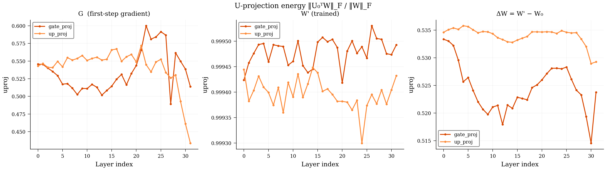

### V-projection energy (rectangular `down_proj` only)

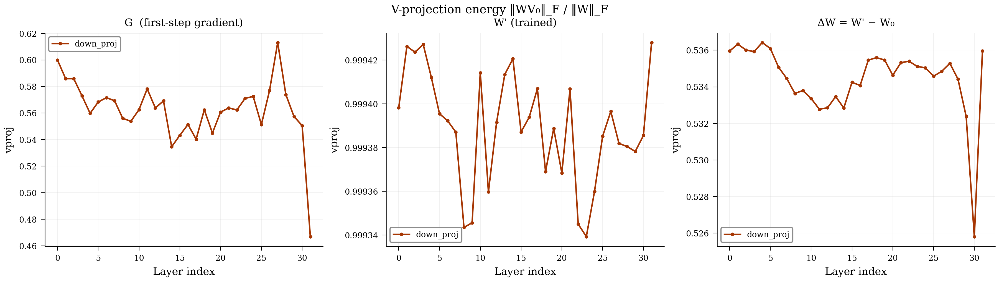

### Singular-value & singular-vector overlap (representative layers)

Each figure is a 7×3 grid. Rows = module type (`q,k,v,o,gate,up,down_proj`). Columns = (S − S₀, |⟨U₀[:,i],U[:,i]⟩|, |⟨V₀[i,:],V[i,:]⟩|). x-axis is the singular index i = 0..min(out, in)−1. Note: under near-degenerate σ₀ the per-column dot product can swing within a degenerate eigenspace even when the *subspace* is preserved; for a cleaner subspace metric see `compute_principal_angles` in `analysis/analyze_weights.py`.

#### G  (first-step gradient)

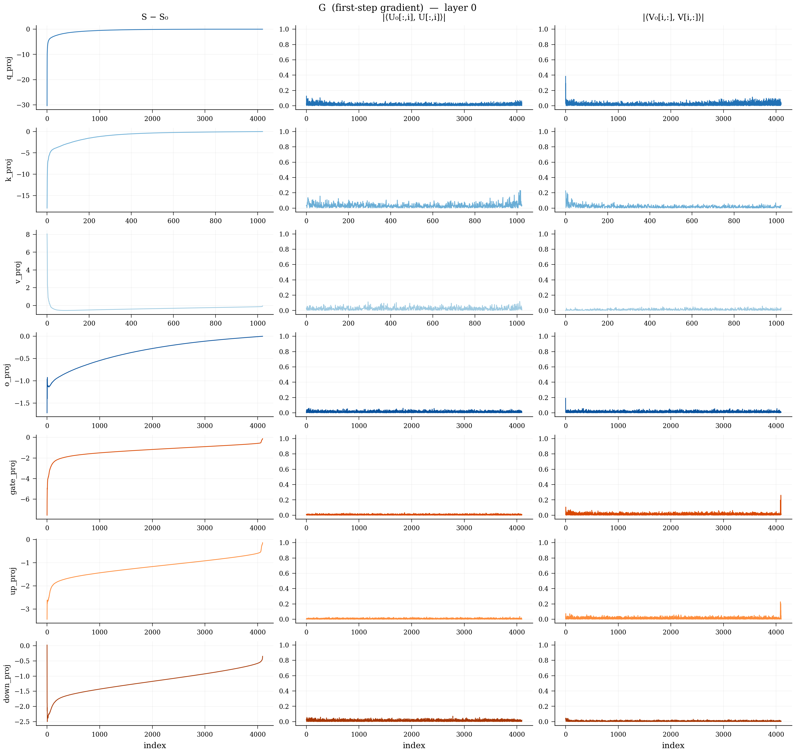

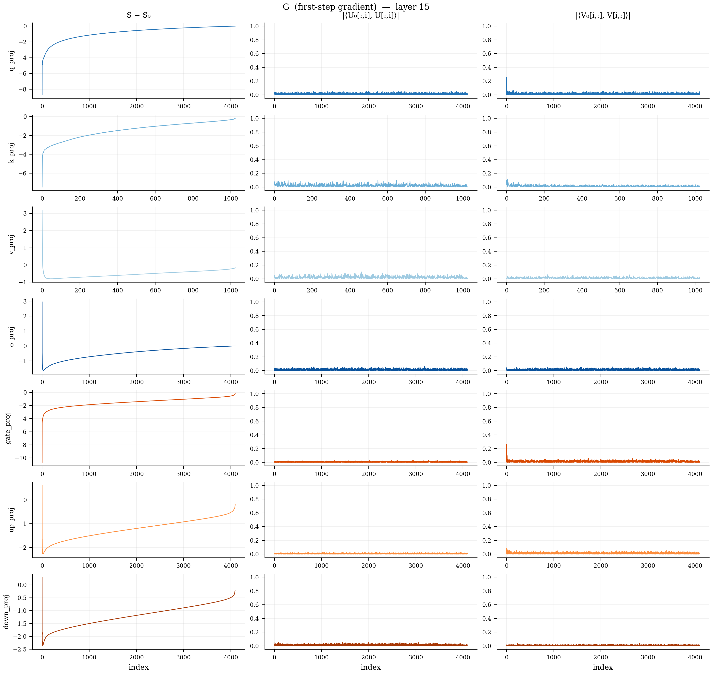

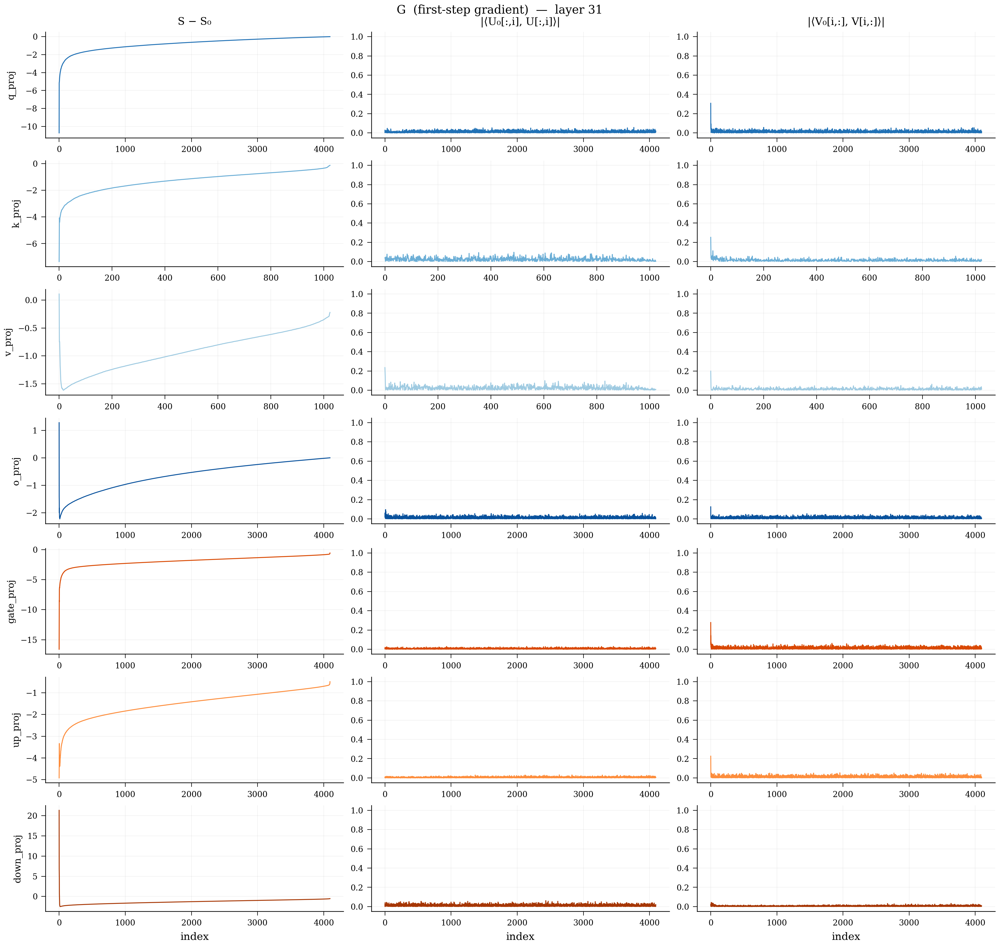

#### W' (trained)

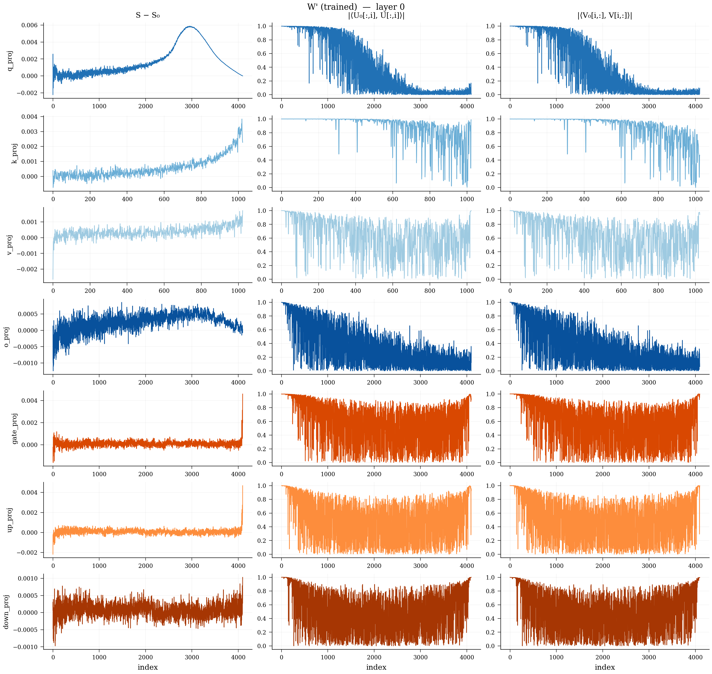

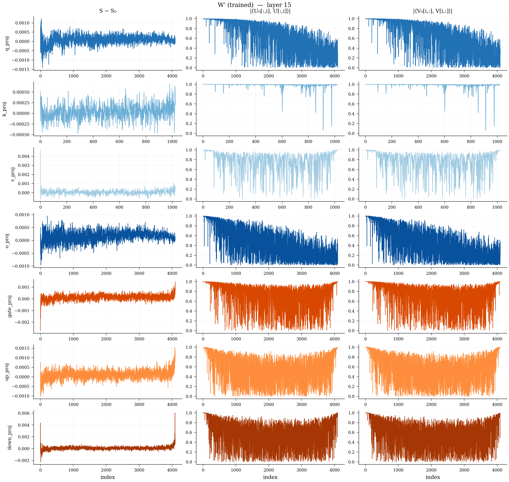

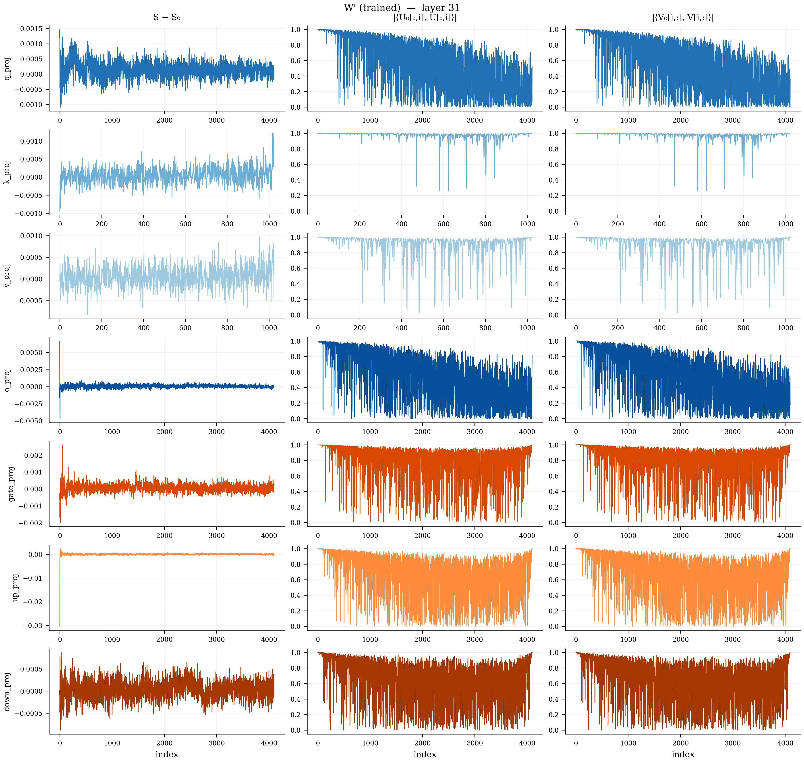

#### ΔW = W' − W₀

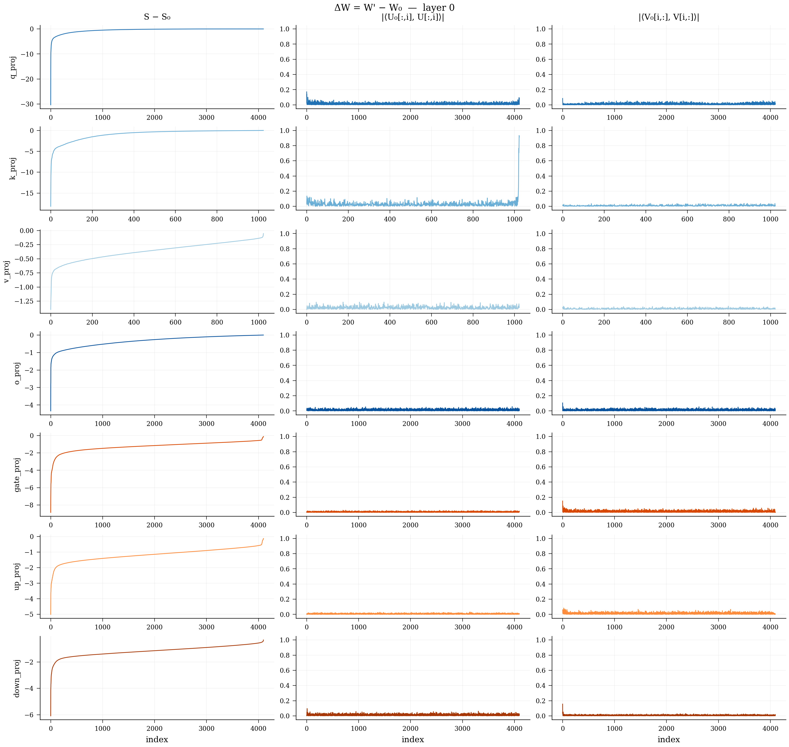

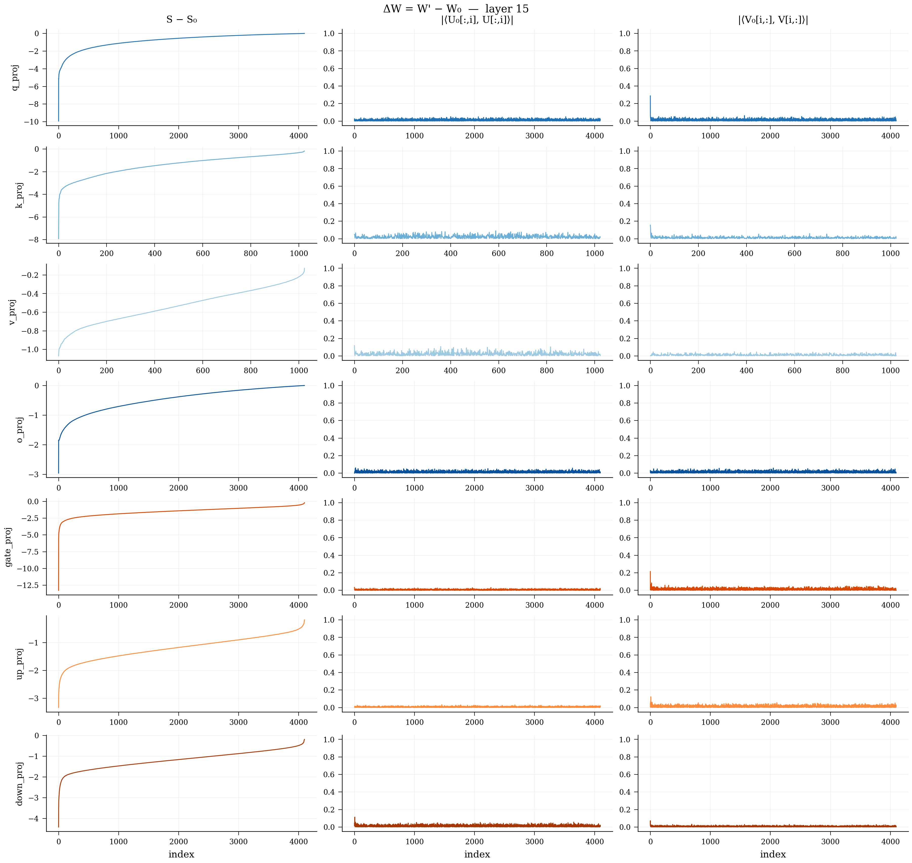

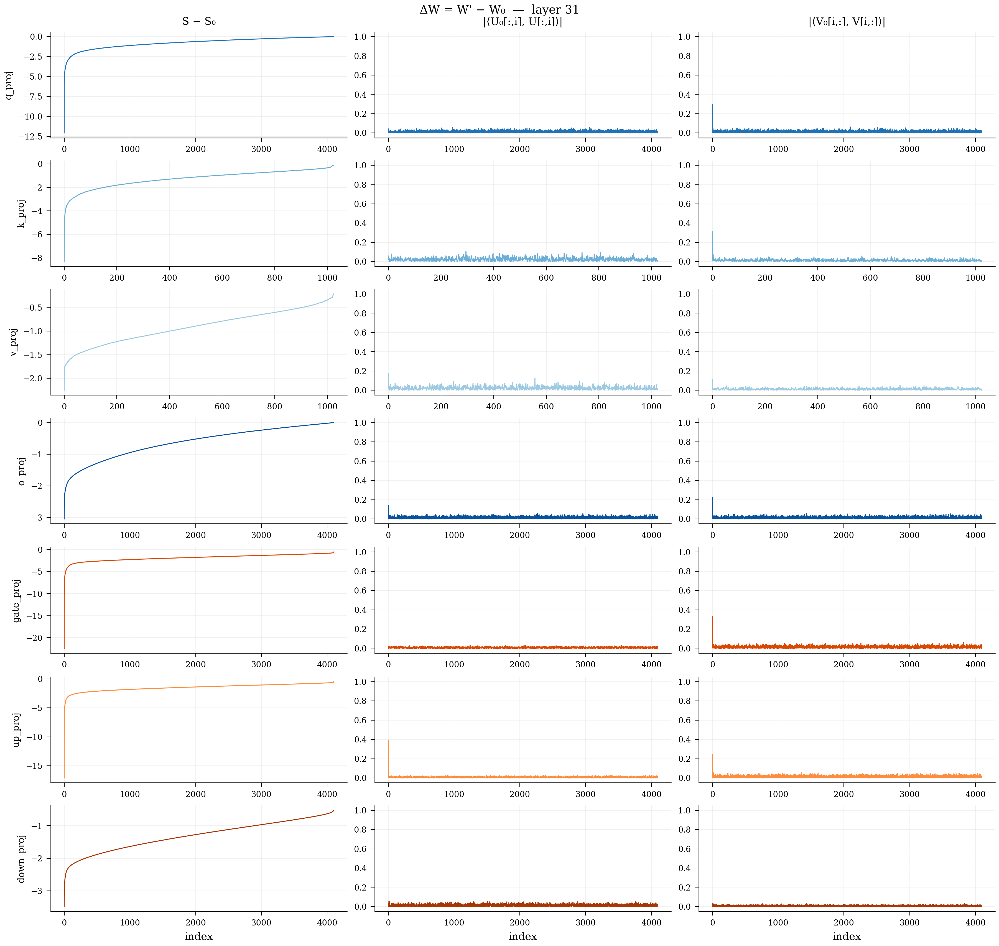

## Discussion

The three quantities show three distinctly different spectral relationships
with W₀:

- **G (first-step gradient)** has u_proj/v_proj ≈ 0.5 on `gate_proj`,
  `up_proj`, `down_proj` — essentially indistinguishable from the random-Gaussian
  baseline of √(4096/14336) ≈ 0.534. The per-column overlaps |⟨U₀,U⟩| and
  |⟨V₀,V⟩| are flat near zero across the entire singular index range. The
  gradient lives in a high-rank subspace that is approximately orthogonal to
  W₀'s.
- **W′ (trained checkpoint)** has u_proj/v_proj ≈ 0.9994 — essentially 1.0,
  meaning W′ inherits W₀'s left/right singular subspaces almost perfectly. The
  per-column overlap curves |⟨U₀,U⟩| and |⟨V₀,V⟩| start at 1.0 for the top
  singular vectors and decay smoothly toward 0 for trailing indices. The
  spectrum drift `S − S′` is on the order of 1e-3 — three orders of magnitude
  smaller than W₀'s singular values themselves. **W′ ≈ W₀ to first order in
  the spectral structure.**
- **ΔW = W′ − W₀** looks much more like G than like W′: u_proj/v_proj ≈ 0.52
  (slightly above the random baseline), per-column overlaps near zero, S − S₀
  pattern matching G's. **The total update direction inherits the
  high-rank/random-subspace character of the gradient, not the principal-subspace
  character of W₀.** This is the LoRA-relevant observation: a low-rank
  adapter that lives only in W₀'s top subspaces will struggle to express ΔW.

Caveat: per-column dot products are noisy under near-degenerate singular
values (the basis can rotate within a degenerate eigenspace even when the
*subspace* is preserved). For a cleaner subspace-level metric see
`compute_principal_angles` in `analysis/analyze_weights.py`.

## Verification appendix

- **Identity check** (W = W₀ fed through the metric pipeline): max deviation across `u_dot−1`, `v_dot−1`, `S−S₀` was **2.86e-03**. This is float32 noise on inner products of 4096-dim vectors plus sign / basis-rotation ambiguity within near-degenerate σ₀ eigenspaces — not a bug. The Frobenius `‖S − S₀‖` element value at every index was effectively zero.
- **Square-attn trivial check** (u_proj, v_proj of ΔW on q/k/v/o_proj): u_proj range [0.999466, 0.999584], v_proj range [1.000976, 1.001185] across 128 square-attn (layer, module) entries. Should be ≈ 1.0 — confirms the skip-condition.
- **Random-Gaussian baseline for `gate_proj` u_proj** (layer 0 W₀, random W of same shape): observed = **0.5343**, expected ≈ √(out/in) = √(4096/14336) ≈ 0.5345.
- **Random-Gaussian baseline for `down_proj` v_proj**: observed = **0.5343**, expected ≈ √(out/in) = √(4096/14336) ≈ 0.5345.

## Reproduction

```bash
# 1. One-time gradient collection (~3 min, single H100)
CUDA_VISIBLE_DEVICES=0 uv run python analysis/compute_first_step_grad.py \
    --base-model meta-llama/Meta-Llama-3-8B \
    --data-path ref/LIFT/LLM-Adapters/ft-training_set/commonsense_170k.json \
    --seed 43 \
    --output analysis_results/grad_step1__llama3-8b__seed43.pt

# 2. Spectral analysis (~10 min, single H100)
CUDA_VISIBLE_DEVICES=0 uv run python analysis/spectral_projection.py \
    --base-model meta-llama/Meta-Llama-3-8B \
    --checkpoint /data/yequan/fura/lift/commonsense/meta-llama/Meta-Llama-3-8B/full-lr_1e-5-seed_43/last \
    --gradient analysis_results/grad_step1__llama3-8b__seed43.pt
```
